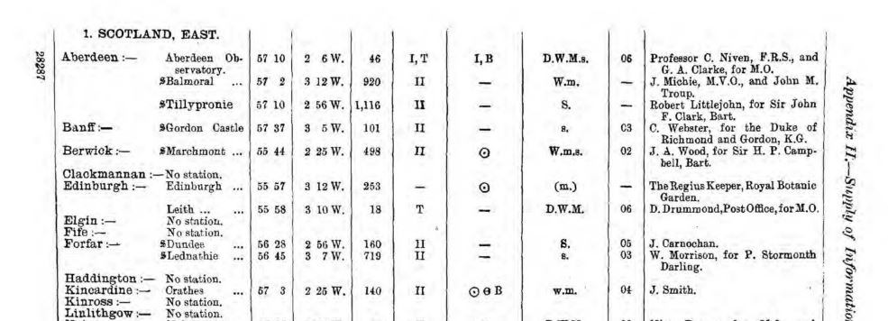
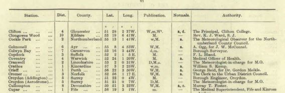

# Station List and Tables in Met Office documents

The Met Office published tables listing British and Irish stations in various forms over time:

* [Met Office Annual Reports](https://digital.nmla.metoffice.gov.uk/index.php?name=SO_e75e4cf3-9be6-47f9-9444-0c2debbcef83) 1860s-1911

* [Monthly Weather Reports](https://digital.nmla.metoffice.gov.uk/SO_672294fb-176b-4de6-b393-4ee3a1cacbad/) 1909-1960+

The relevant pages from these volumes have been extracted into the set of PDF files in this folder. (Note that the PDFs are too big for GitHub to display - ~10-100 MB - but can be downloaded.)

For a period in the 1930s, the Met Office published a detailed Gazetteer of its Daily Weather Report stations, two pages per station, available [here](https://digital.nmla.metoffice.gov.uk/index.php?name=SO_287be104-9fea-4e33-aa77-0f689aa9e484).

